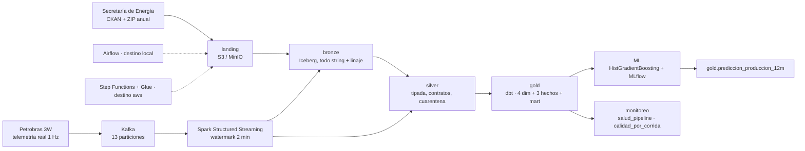

# YPF Data Platform


Plataforma de datos end-to-end del upstream argentino construida sobre datos públicos reales de
la Secretaría de Energía (2006-2026) y telemetría real de pozos de Petrobras. Cubre el camino
completo: ingesta idempotente, lakehouse medallion en Iceberg, contratos de calidad, modelo
dimensional en dbt, streaming con Kafka, un modelo de ML validado y observabilidad, con el mismo
código corriendo en local sobre Podman y en AWS sobre Glue. Es un proyecto de portfolio: está
pensado para que alguien que evalúa perfiles de ingeniería de datos pueda leer las decisiones,
correrlo y verificar los números.

## Arquitectura



Un stack, dos destinos (ADR 0001): el mismo código de `pipelines/` corre sobre Docker Compose
(MinIO, Iceberg REST, Spark, Airflow) y sobre AWS (S3, Glue Data Catalog, Glue jobs, Step
Functions, Athena). Lo único que cambia es la configuración; las pocas funciones que Spark y
Athena escriben distinto viven en una macro de dbt (ADR 0010).

## Fuentes

| Fuente | Tabla silver | Filas | Cadencia | Ficha |
| --- | --- | ---: | --- | --- |
| Producción de petróleo y gas por pozo (DDJJ) | `silver.produccion_pozo` | 18.218.514 | mensual | [produccion_pozo.md](docs/fuentes/produccion_pozo.md) |
| Padrón de pozos con primera producción | `silver.pozo_primera_produccion` | 86.197 | mensual | [pozo_primera_produccion.md](docs/fuentes/pozo_primera_produccion.md) |
| Datos de fractura (Adjunto IV) | `silver.fractura` | 4.878 | diaria | [fractura.md](docs/fuentes/fractura.md) |
| Reservas y recursos al 31/12 | `silver.reservas` | 198.734 | anual (2020-2024) | [reservas.md](docs/fuentes/reservas.md) |
| Telemetría de pozos 3W (Petrobras) | `silver.telemetria_pozo_1min` | 7.774 ventanas | replay a demanda | [telemetria_3w.md](docs/fuentes/telemetria_3w.md) |

Las dos primeras salen del mismo dataset de CKAN; reservas es un ZIP suelto por URL fuera del
portal.

## Trazabilidad: qué es real, qué es simulado y qué es derivado

Cada tabla del lakehouse declara una columna `data_origin`. No hay datos inventados presentados
como reales.

| Tabla | `data_origin` | Qué es |
| --- | --- | --- |
| `bronze/silver.produccion_pozo`, `bronze/silver.pozo_primera_produccion` | `real` | DDJJ y padrón publicados por la Secretaría de Energía |
| `bronze.pozo_catalogo`, `bronze.produccion_pozo_no_convencional` | `real` | Agregados que publica el mismo portal; se cargan pero todavía no tienen contrato |
| `bronze/silver.fractura` | `real` | Declaraciones del Adjunto IV, dato preliminar sujeto a revisión |
| `bronze/silver.reservas` | `real` | Planillas anuales de reservas y recursos por yacimiento |
| `bronze.pozo_map_3w` | `simulated` | **Mapeo ficticio**: reparte los pozos de 3W entre 13 `idpozo` reales de la Neuquina |
| `bronze.telemetria_pozo` | `simulated` | Sensores **reales** de Petrobras; el pozo argentino al que se los asocia es ficticio, el `event_time` está rebaseado y los eventos tardíos los retiene el productor a propósito |
| `silver.telemetria_pozo_1min` | `simulated` | Agregación por minuto de lo anterior |
| `gold.dim_*`, `gold.fact_*`, `gold.mart_*` | `derived` | Modelo dimensional calculado sobre silver |
| `gold.prediccion_produccion_12m` | `derived` | Salida del modelo de ML, no una medición |
| `gold.salud_pipeline`, `gold.calidad_por_corrida` | `derived` | Metadatos del propio pipeline |

## Qué demuestra cada módulo

| Módulo | En una línea |
| --- | --- |
| `pipelines/ingest/` | **Idempotencia** en dos niveles (tamaño/fecha de origen y sha256) con manifiesto en Postgres |
| `pipelines/spark_jobs/bronze_load.py` | Carga cruda con **linaje** por fila y reemplazo de partición por recurso |
| `pipelines/contracts/` + `silver_load.py` | **Contratos de datos** declarativos: tipos, rangos, checks duros y cuarentena auditable |
| `pipelines/dbt/models/` | Modelo dimensional con **SCD tipo 2** sobre 21 años, tests y documentación por columna |
| `pipelines/streaming/` | **Streaming con watermark**: exactly-once en bronze por checkpoint, agregación por ventana en silver |
| `pipelines/ml/` | **Validación por grupo** (`GroupKFold` por yacimiento) para no filtrar información entre pozos vecinos |
| `pipelines/dbt/models/monitoreo/` | **Observabilidad** con lo que ya hay: frescura de fuentes y mart de salud, sin servicios nuevos |
| `orchestration/dags/` | Airflow que **solo orquesta**: cada tarea lanza un contenedor efímero |
| `infra/terraform/` | **IaC** completa del destino aws: 29 recursos, `terraform destroy` deja costo cero |
| `.github/workflows/ci.yml` | **CI** en tres jobs: lint y tests, `terraform validate`, y que los DAGs importen |

## Correrlo

### Local, en unos diez minutos

Requisitos: Podman (o Docker), `uv`, y `infra/docker/.env` con las credenciales de MinIO y
Postgres. La primera corrida de Spark baja ~700 MB de jars; las siguientes arrancan en segundos.

```powershell
cd infra\docker
podman-compose --profile core up -d                     # MinIO, Postgres, catálogo Iceberg
cd ..\..
uv sync

uv run ingest run --dataset fractura                    # landing (la más chica: ~5 MB)
scripts\spark-submit.ps1 pipelines/spark_jobs/bronze_load.py --dataset fractura
scripts\spark-submit.ps1 pipelines/spark_jobs/silver_load.py --contract fractura
scripts\dbt.ps1 build                                   # gold: 10 modelos y sus tests
uv run python scripts/check_lake.py --namespace gold    # filas y snapshots por tabla
```

Los otros perfiles del compose son opcionales y se levantan por separado:
`--profile airflow` (UI en <http://localhost:8080>), `--profile mlflow` (<http://localhost:5000>,
después `uv run python -m pipelines.ml.entrenar`) y `--profile streaming` con
`scripts\streaming-demo.ps1 -Segundos 600 -Velocidad 60`. Detalles en
[`orchestration/README.md`](orchestration/README.md) y en las fichas de `docs/`.

### AWS

```powershell
cd infra\terraform
terraform init; terraform apply       # 29 recursos: S3, Glue, Step Functions, Athena, IAM
..\..\scripts\aws_deploy.ps1          # wheel del proyecto + wrappers de los jobs a S3
aws stepfunctions start-execution --state-machine-arn <arn> --input '{}'
```

**Costos medidos** (2026-09-06): reconstruir el entorno entero desde cero —cuatro máquinas de
estados, incluidas las descargas— cuesta **menos de 2 USD** y tarda alrededor de una hora. El
job de gold (`dbt build` sobre Athena) son **0,15 USD por corrida**. En reposo el entorno cuesta
**cero**: no hay NAT Gateway, ni RDS, ni EMR, ni MWAA, y los schedules de EventBridge nacen
deshabilitados. El procedimiento completo está en
[`infra/terraform/README.md`](infra/terraform/README.md).

## Resultados

- **18.218.514 filas** de producción mensual por pozo (2006-2026) cargadas y tipadas. Entre las
  cuatro fuentes quedaron **238 filas en cuarentena** (224 de producción, 12 de fractura, 2 de
  reservas) y ningún recurso falló un check duro. Los dos destinos dan exactamente las mismas
  filas y las mismas claves surrogate.
- **`dim_pozo` con 611.304 tramos** SCD tipo 2 sobre 21 años de declaraciones, con tests de
  unicidad y de no solapamiento de vigencias.
- **El acumulado de petróleo a 12 meses crece 7 veces** entre los pozos no convencionales de
  menos de 20 etapas de fractura y los de más de 40 (cuenca Neuquina).
- **El modelo explica el 38 % de la varianza fuera de muestra** (R² 0,381 con `GroupKFold` por
  yacimiento) contra −0,212 del baseline de mediana. El matiz importa: con un split aleatorio el
  R² sube a 0,737, y esos 36 puntos son fuga de información entre pozos vecinos; se reporta el
  número honesto. Además, las dos features más pesadas describen *cuándo* se fracturó, no cómo.
- **468.001 eventos publicados en Kafka y 468.001 filas en bronze**, sin duplicados ni pérdidas,
  después de tres reinicios del consumidor (uno de ellos un `podman kill` a mitad de camino).
  Con cortes largos, los 4.588 eventos que el watermark descartó de la agregación quedaron
  enteros en el crudo.
- **CI en verde**: 167 tests, `ruff check`, `ruff format --check`, `terraform validate` y la
  verificación de que los seis DAGs importan.

## Qué se verificó y qué no

Lo que sigue son limitaciones reales del proyecto, no pendientes de redacción.

- **El modelo de ML se entrena con 351 pozos.** Es el subconjunto que tiene los 12 meses de
  producción declarados sobre 3.825 no convencionales. Con 5 folds y 43 yacimientos, el
  intervalo de confianza del R² es ancho y la diferencia entre folds (0,040 a 0,384) es del
  orden de la métrica. Las cinco limitaciones están escritas en
  [`docs/ml/`](docs/ml/modelo-completacion-produccion.md) y son parte del entregable.
- **El mapeo de pozos del streaming es ficticio.** La telemetría es real (Petrobras), el pozo
  argentino al que se la asocia no. No existe telemetría pública de pozos argentinos.
- **El catálogo Iceberg local usa SQLite** (ADR 0003) y acepta un solo escritor: con dos queries
  de streaming commiteando a la vez se pisan y hay que reiniciar el contenedor del catálogo. En
  AWS el catálogo es Glue y el problema no existe.
- **Los jobs de Glue no corren en paralelo.** Dos pipelines de fuente comparten `ingest_landing`
  y `silver_load`, así que las máquinas de estados se disparan de a una.
- **No hay ambientes dev/prod.** Hay un destino local y un destino aws efímero, con un solo
  `terraform.tfstate` local y sin backend remoto ni workspaces.
- **No hay alertas externas.** Las fallas quedan en el log de Airflow, escritas por un callback
  compartido (`orchestration/dags/alertas.py`); conectar correo o Slack es cambiar esa función y
  nada más. Un webhook en un repo público sería un secreto en el repo.
- **La observabilidad es local.** Los modelos de `monitoreo` están deshabilitados en el destino
  aws: miran tablas que allá no existen y leen metadata de Iceberg con sintaxis de Spark.
- **El CI no levanta el stack.** Valida lint, tests unitarios, Terraform e imports de DAGs; que
  los jobs de Spark corran de verdad contra Iceberg se verifica a mano en local (ADR 0007).
- **La ingesta de producción usa la familia "DDJJ abiertas y cerradas"**, comparada un año
  completo (2024) contra la familia normal: es superconjunto estricto (0 filas con valores en
  conflicto en lo que comparten, +159 declaraciones rectificadas que la normal no tiene) y es
  la única que la Secretaría sigue actualizando — la normal quedó congelada 5 meses antes
  según CKAN. Detalle en
  [`docs/fuentes/comparacion-familias-produccion.md`](docs/fuentes/comparacion-familias-produccion.md).

## Documentación

- **Decisiones de arquitectura** — [`docs/adr/`](docs/adr/): un stack dos destinos (0001),
  DuckDB y Athena (0002), catálogo SQLite (0003), Spark en contenedor (0004), contratos en YAML
  (0005), Airflow solo orquesta (0006), CI (0007), Glue y Step Functions (0008), gold con dbt
  (0009), gold en aws con dbt-athena (0010), streaming (0011), ML con MLflow (0012).
- **Fuentes** — [`docs/fuentes/`](docs/fuentes/): perfil medido de fractura, reservas y 3W;
  [`docs/semana-0-derisking.md`](docs/semana-0-derisking.md) tiene las pruebas contra las
  fuentes reales previas a escribir infraestructura.
- **Aprendizaje** — [`docs/aprendizaje/recorrido-del-codigo.md`](docs/aprendizaje/recorrido-del-codigo.md):
  recorrido guiado por el código en 8 sesiones, para quien sabe Python y SQL pero no vio Spark,
  Iceberg ni Airflow; y `aws-azure-databricks.md`, guía de estudio de los servicios equivalentes
  en las tres nubes, con precios citados de las páginas oficiales.
- **ML** — [`docs/ml/modelo-completacion-produccion.md`](docs/ml/modelo-completacion-produccion.md):
  datos, features, evaluación, SHAP y limitaciones.
- **Módulos** — READMEs propios en [`pipelines/ingest/`](pipelines/ingest/README.md),
  [`pipelines/contracts/`](pipelines/contracts/README.md),
  [`orchestration/`](orchestration/README.md) e [`infra/terraform/`](infra/terraform/README.md).

## Licencias y atribuciones

- **Datos del upstream argentino**: Secretaría de Energía de la Nación Argentina, portal
  [datos.energia.gob.ar](http://datos.energia.gob.ar). Datos públicos; producción y fractura son
  declaraciones juradas de las operadoras y fractura se publica como dato preliminar sujeto a
  revisión.
- **Telemetría de pozos**: dataset **3W de Petrobras**
  ([github.com/petrobras/3W](https://github.com/petrobras/3W)), archivos de datos bajo
  **CC BY 4.0**. Citas pedidas por el proyecto: Vargas, R. E. V. et al., *"A realistic and public
  dataset with rare undesirable real events in oil wells"*, Journal of Petroleum Science and
  Engineering 181 (2019), DOI [10.1016/j.petrol.2019.106223](https://doi.org/10.1016/j.petrol.2019.106223);
  y *"3W Dataset 2.0.0"*, Scientific Data 13, 949 (2026),
  DOI [10.1038/s41597-026-07225-z](https://doi.org/10.1038/s41597-026-07225-z).
- **Este repositorio** no está afiliado a YPF S.A. ni a ninguna de las operadoras que aparecen
  en los datos. El nombre refiere al dominio del problema, no a la compañía.
